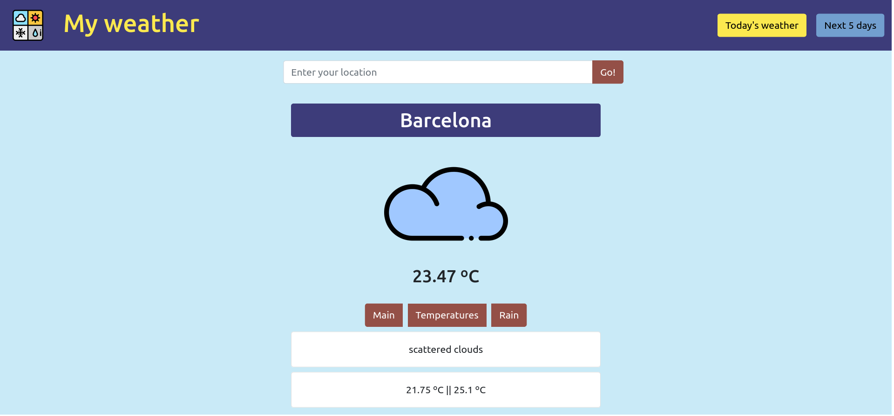

# My Weather App

Simple Weather App built with React and fetched information from Open Weather API.

# Installation

- Run `npm install` or `yarn install`
- Go to [Open Weather API](https://openweathermap.org/api) and get a free key.
- Inside src folder create a new document called APIkey.js and paste:
  - `const Weather_API_Key = "paste your API key inside quotes";`
  - `export default Weather_API_Key;`
- Finally run `yarn start`

# Screenshots

## Icon attribution
<a href="https://www.flaticon.com/free-icons/weather" title="weather icons">Weather icons created by Freepik - Flaticon</a>

<a href="https://www.flaticon.com/packs/weather-507" title="weather icons">Icon Pack: Weather | Lineal color created by Freepik - Flaticon</a>
